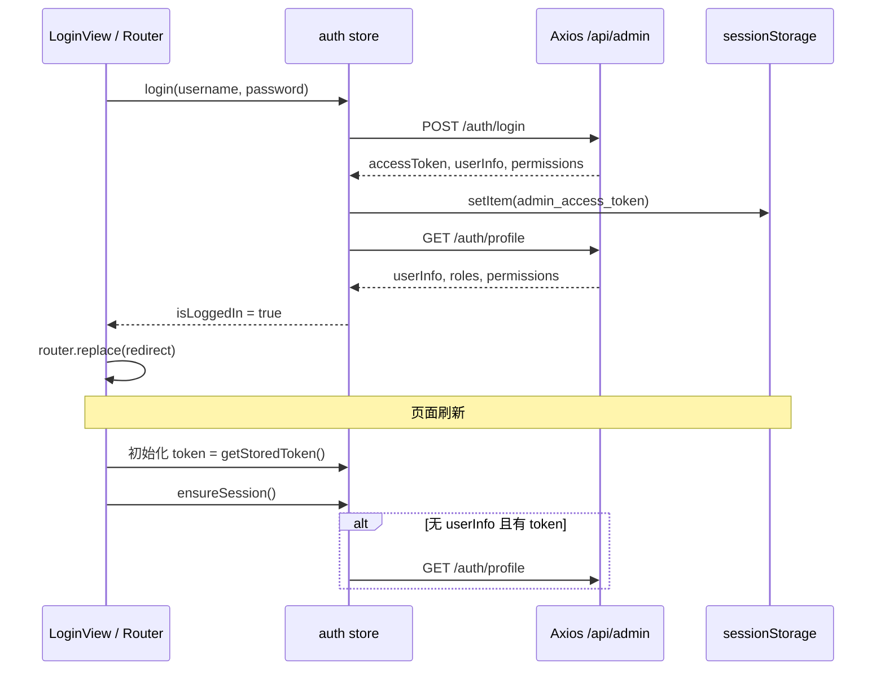

# 024 · Step 9 Phase 1 admin-web 管理端认证基础与应用壳层

**交付日期**：2026-06-12  
**基于**：008-step3-auth-module.md、009-step3-auth-security-closure.md、023-step8-kiosk-test-hygiene-closure.md  
**状态**：✅ 完成

---

## 一、任务范围

在 `admin-web` 建立管理端认证基础与应用壳层：统一 Axios API 层、Pinia 认证 Store、登录页、路由守卫、基础布局（侧边栏 + 顶栏 + Dashboard 占位）、轻量 Vitest 测试。

**本阶段未实现**：用户/角色管理页、内容管理、审核发布、首页配置、数据统计及任何二期功能。

**未修改**：`backend/**`、`kiosk-app/**`（业务逻辑）、数据库及迁移、`deploy/**`、`docs/database.md`、`docs/architecture.md`、`docs/api-spec.md`、`docs/review-rules.md`。

**未访问数据库**：未连接 `oms_db`、`mydb`、`touch_kiosk_dev`、`touch_kiosk_test` 或任何其他项目数据库。

---

## 二、实际修改文件

### admin-web（本阶段主改动）

| 文件 | 说明 |
|---|---|
| `admin-web/src/api/types.ts` | 统一信封、UserInfo、Login/Profile 类型 |
| `admin-web/src/api/http.ts` | Axios `/api/admin`、Bearer、信封解析、401 处理、sessionStorage Token |
| `admin-web/src/api/auth.ts` | login / profile / logout API 封装 |
| `admin-web/src/stores/auth.ts` | Pinia 认证 Store |
| `admin-web/src/router/redirect.ts` | `safeRedirectPath` 防开放重定向 |
| `admin-web/src/router/index.ts` | 路由表 + `registerAuthGuard` |
| `admin-web/src/pages/LoginView.vue` | 登录页（Element Plus 校验、password 类型、防重复提交） |
| `admin-web/src/pages/DashboardView.vue` | 工作台占位首页 |
| `admin-web/src/pages/NotFoundView.vue` | 404 页 |
| `admin-web/src/layouts/AdminLayout.vue` | 侧边栏、顶栏、用户信息、退出 |
| `admin-web/src/App.vue` | 根组件仅 `<router-view />` |
| `admin-web/src/main.ts` | Pinia、Router、Element Plus、守卫注册 |
| `admin-web/src/styles/main.css` | 全局基础样式 |
| `admin-web/package.json` | 增加 `vue-tsc`、`vitest`、测试依赖与 `test` 脚本 |
| `admin-web/package-lock.json` | 依赖锁定（`npm install` 生成） |
| `admin-web/tsconfig.json` | 纳入 `src/**/*.vue` |
| `admin-web/.gitignore` | 忽略 `dist/`、`tests/.vitest-cache/` |
| `admin-web/tests/vitest.config.ts` | Vitest 配置 |
| `admin-web/tests/setup.ts` | 测试 setup |
| `admin-web/tests/auth.store.spec.ts` | Store 单元测试 |
| `admin-web/tests/auth-flow.spec.ts` | 认证链路集成测试（HTTP mock） |
| `admin-web/tests/router.guard.spec.ts` | 路由守卫测试 |
| `admin-web/tests/http.unauthorized.spec.ts` | 401 拦截器测试 |
| `admin-web/tests/redirect.spec.ts` | 安全重定向测试 |

### 其他

| 文件 | 说明 |
|---|---|
| `CLAUDE.md` | 更新 admin-web 开发状态 |
| `docs/dev-logs/024-step9-admin-auth-shell.md` | 本报告 |

**保留未撤销**：`kiosk-app/tests/.vitest-cache/vitest/results.json` 索引删除（`git status` 仍可能显示 `D`，属 Step 8 卫生收口）。

---

## 三、后端契约核对（以实际代码为准）

| 接口 | 方法 | `data` 结构 |
|---|---|---|
| `/api/admin/auth/login` | POST | `{ accessToken, userInfo, permissions }`（**无** `roles`） |
| `/api/admin/auth/profile` | GET | `{ userInfo, roles, permissions }`（SUPER_ADMIN → `permissions: ['*']`） |
| `/api/admin/auth/logout` | POST | `null` |

统一信封：`{ code, message, data, timestamp, requestId }`；`code !== 0` 为失败；401 可为 HTTP 401 或 HTTP 200 + `code: 401`。

---

## 四、登录与会话数据流



1. **登录**：`loginApi` → 写入 `sessionStorage` → 调 `fetchProfile` 补全 `roles`。
2. **刷新**：Store 初始化从 `sessionStorage` 读 Token；守卫对受保护路由调用 `ensureSession()`，无 `userInfo` 时拉 profile。
3. **退出**：`logoutApi`（失败亦继续）→ `clearSession()` 清 Store 与 `sessionStorage`。
4. **401**：Axios 响应拦截或 `ensureSession` 捕获 `ApiError(401)` → `clearSession` → 跳转 `/login`（带安全 `redirect`）。

---

## 五、Token 存储位置

| 项 | 策略 |
|---|---|
| Key | `sessionStorage['admin_access_token']` |
| 持久化 | **仅** sessionStorage，不用 localStorage |
| 密码 | 不存储；登录成功后清空表单密码字段 |
| Pinia 持久化插件 | **未引入** |
| 日志/界面 | 不输出完整 Token、密码或敏感响应字段 |

---

## 六、路由守卫行为

| 场景 | 行为 |
|---|---|
| 未登录访问受保护页 | → `/login?redirect=<站内安全路径>` |
| 已登录访问 `/login` | `ensureSession` 成功 → `/dashboard` 或安全 `redirect` |
| 刷新受保护页 | 有 Token 则 `ensureSession` → profile 验证 |
| profile 401 | `clearSession` → `/login` |
| 防死循环 | 比较 `from`/`to` 路径，重复重定向时 `next(false)` |
| 开放重定向 | `safeRedirectPath` 仅接受以 `/` 开头且非 `//`、非 `/login` 的站内路径 |

路由表：`/login`（公开）、`/` → `/dashboard`（需登录）、嵌套 404、无虚假业务页。

---

## 七、401 处理方式

1. **Axios 响应拦截**：`body.code === 401` 或 HTTP status `401` → `triggerUnauthorized()`（防抖）→ 已绑定 handler。
2. **Store `bindUnauthorizedHandler`**：`clearSession()` + `router.replace('/login')`。
3. **`ensureSession`**：profile 失败且 `code === 401` → `clearSession()`，守卫再导向登录页。

---

## 八、权限判断规则

```typescript
hasPermission(code):
  roles 含 SUPER_ADMIN → true
  permissions 含 '*' → true
  否则 permissions.includes(code)
```

登录响应无 `roles`，以 profile 为准；Dashboard 仅展示信息，本阶段无路由级 permission meta。

---

## 九、自动化测试覆盖

| 文件 | 用例 |
|---|---|
| `auth.store.spec.ts` | 登录成功保存、登录失败不存 Token、profile 恢复、401 清理、SUPER_ADMIN、`*` 通配、精确权限、退出清理 |
| `auth-flow.spec.ts` | 未登录拦截、登录成功、刷新 profile 恢复、Token 失效、主动退出 |
| `router.guard.spec.ts` | 未登录 → login、已登录访问 login → dashboard |
| `http.unauthorized.spec.ts` | 业务 code=401、HTTP 401 触发 handler |
| `redirect.spec.ts` | 站内路径 / 外部与 login 拒绝 |

全部使用 **axios-mock-adapter / vi.mock**，不依赖真实数据库与真实密码。

---

## 十、验证命令及真实结果

### admin-web

```bash
cd admin-web
npm run type-check   # exit 0
npm run build        # exit 0，vite build 成功
npm test             # 5 files, 19 tests passed
```

### backend（回归，未改代码）

```bash
cd backend
npm run type-check   # exit 0
npm test -- --runInBand   # 14 passed, 6 skipped, 341 tests passed
```

### kiosk-app（回归，未改本阶段代码）

```bash
cd kiosk-app
npm run build                              # exit 0
npx vue-tsc --noEmit -p tsconfig.check.json   # exit 0
cd tests && npm test                       # 17 files, 91 tests passed
```

---

## 十一、管理端认证链路验证

### A. 自动化（HTTP mock，见 `auth-flow.spec.ts`）

| 场景 | 结果 |
|---|---|
| 未登录访问 `/dashboard` | ✅ 跳转 `/login?redirect=/dashboard` |
| 登录成功 | ✅ Token + userInfo + roles 写入 Store |
| profile 恢复 | ✅ 仅有 Token 时拉 profile 后进入 `/dashboard` |
| 刷新页面（模拟） | ✅ `ensureSession` + profile mock |
| Token 失效 | ✅ 清 sessionStorage，跳转登录 |
| 主动退出 | ✅ logout + 清状态 |
| 无权限判断 | ✅ `content:write` 为 false |
| `*` 通配权限 | ✅ SUPER_ADMIN / `permissions: ['*']` 为 true |

### B. 联调（本地 backend 已启动，无 DB 种子用户）

| 场景 | 结果 |
|---|---|
| `GET /api/admin/auth/profile` 无 Token | HTTP **401** |
| `POST /api/admin/auth/login` 错误凭据 | `{ code: 401, message: "用户名或密码错误" }` |

说明：项目规范**不创建默认管理员**（见 012 dev-log），开发库无种子账号时无法在浏览器完成真实账号登录；UI 登录失败提示已与后端安全文案对齐（curl 验证）。完整正向登录链路由 mock 集成测试覆盖。

---

## 十二、未完成事项与风险

| 项 | 说明 |
|---|---|
| 路由级 permission meta | 本阶段仅 Store 提供 `hasPermission`，业务路由权限在后续模块页接入 |
| 菜单占位 | 仅「工作台」可导航，未建假页面 |
| 生产 chunk 体积 | Element Plus 导致主包 >500kB 警告，后续可按路由拆包 |
| 真实账号 E2E | 需用户在 `touch_kiosk_dev` 创建管理员后方可浏览器全链路登录 |
| `authHandlerBound` 单例 | 测试与主应用共用一个 401 handler 绑定标志，当前测试顺序下无问题 |

---

## 十三、跨工程变更声明

| 工程 | 本阶段是否修改 |
|---|---|
| `backend/` | **否** |
| `kiosk-app/` | **否**（工作区保留 Step 8 历史改动） |
| 数据库 / 迁移 | **否** |
| `admin-web/` | **是**（本阶段主体） |

**数据库访问**：本阶段未执行任何 SQL，未连接 `oms_db`、`mydb` 及其他项目库。
