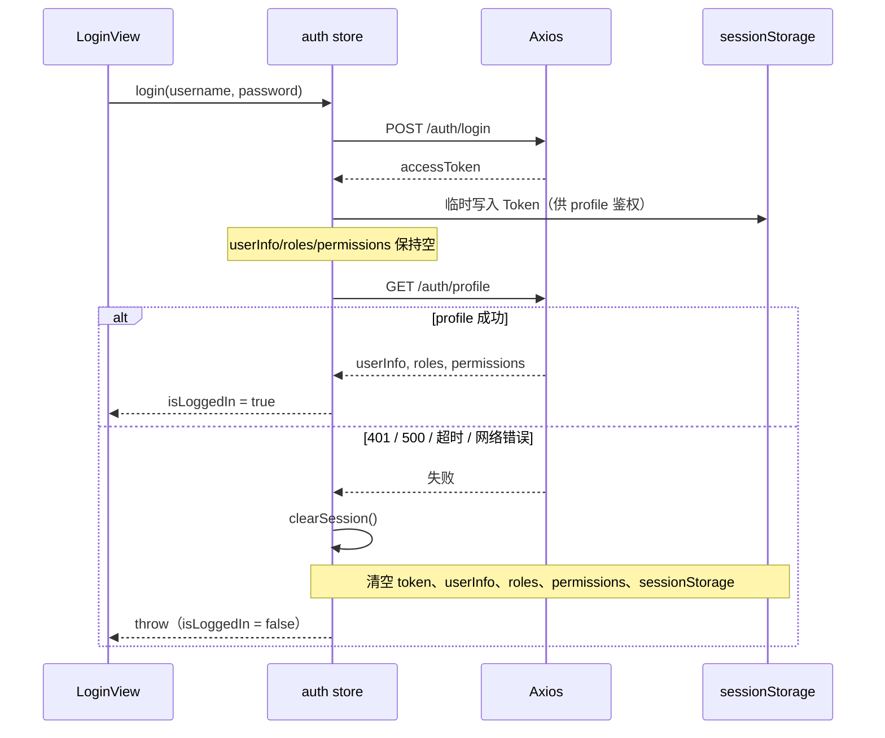

# 025 · Step 9 Phase 1 管理端认证安全收口

**交付日期**：2026-06-15  
**基于**：024-step9-admin-auth-shell.md  
**状态**：✅ 完成

---

## 一、任务范围

修复 admin-web 登录半状态与路由守卫 `authHandlerBound` 全局复用风险；补充安全相关自动化测试；检查 kiosk-app `npm run dev` Vite 缓存权限问题。

**未修改**：数据库及迁移、backend 认证协议、kiosk-app 业务功能、端口配置（3100 / 5183 / 5184）、二期功能。

**未访问数据库**：未连接 `oms_db`、`mydb`、`touch_kiosk_dev`、`touch_kiosk_test` 或任何其他项目数据库。

---

## 二、实际修改文件

| 文件 | 说明 |
|---|---|
| `admin-web/src/stores/auth.ts` | 登录原子化：profile 成功才算完整登录；失败完整回滚 |
| `admin-web/src/router/index.ts` | `WeakSet` 防重复注册；每 Router 实例绑定独立 401 handler；防重复导航 |
| `admin-web/tests/auth.store.spec.ts` | 新增 profile 401/500/网络失败回滚、重试登录用例 |
| `admin-web/tests/router.guard.spec.ts` | 半登录拦截、多 Router handler、重复注册守卫 |
| `kiosk-app/vite.config.ts` | `cacheDir` 改为项目内 `.vite/`（避开 `node_modules/.vite` 权限问题） |
| `kiosk-app/.gitignore` | 忽略 `.vite/` |
| `admin-web/vite.config.ts` | 同步 `cacheDir: .vite/`（预防同类问题） |
| `admin-web/.gitignore` | 忽略 `.vite/` |
| `CLAUDE.md` | 更新 admin-web 状态 |
| `docs/dev-logs/025-step9-admin-auth-security-closure.md` | 本报告 |

---

## 三、登录失败回滚流程



要点：

- login 响应中的 `userInfo` **不再**在 profile 之前写入 Store，避免半登录。
- `isLoggedIn = token && userInfo`；profile 未完成前恒为 `false`。
- `ensureSession` 在 profile 任意失败时统一 `clearSession()`。

---

## 四、路由守卫收口

| 项 | 实现 |
|---|---|
| 重复注册 | `WeakSet<Router>`，同一 Router 只注册一次 `beforeEach` |
| 401 handler | 每次 `registerAuthGuard(target)` 为 **该** Router 绑定 handler，覆盖全局 `setUnauthorizedHandler` |
| 死循环防护 | 已在 `/login` 或目标已是 `login?redirect=...` 时不再 `replace` |
| 开放重定向 | 继续使用 `safeRedirectPath` |

主应用 `main.ts` 仅调用一次 `setupRouterGuards()`。

---

## 五、自动化测试覆盖（新增/强化）

| 用例 | 文件 |
|---|---|
| login 成功 + profile 业务 401 → 完整回滚 | `auth.store.spec.ts` |
| login 成功 + profile HTTP 500 → 完整回滚 | `auth.store.spec.ts` |
| login 成功 + profile 网络失败 → 完整回滚 | `auth.store.spec.ts` |
| 失败后重新登录成功 | `auth.store.spec.ts` |
| 半登录（仅 Token）不能进 `/dashboard` | `router.guard.spec.ts` |
| 多 Router 使用最后注册的 401 handler | `router.guard.spec.ts` |
| 重复 `registerAuthGuard` 不叠加守卫 | `router.guard.spec.ts` |

---

## 六、验证命令及真实结果

### admin-web

```bash
cd admin-web
npm run type-check   # exit 0
npm run build        # exit 0
npm test             # 5 files, 26 tests passed
```

### backend（回归）

```bash
cd backend
npm run type-check   # exit 0
npm test -- --runInBand   # 14 passed, 341 tests passed
```

### kiosk-app（回归）

```bash
cd kiosk-app
npm run build                              # exit 0
npx vue-tsc --noEmit -p tsconfig.check.json   # exit 0
cd tests && npm test                       # 17 files, 91 tests passed
```

---

## 七、端口验证（3100 / 5183 / 5184）

| 端口 | 服务 | 验证方式 | 结果 |
|---|---|---|---|
| **3100** | backend | `ss -tlnp` + `curl http://localhost:3100/api/admin/auth/profile` | LISTEN ✅，HTTP **401**（未登录，符合预期） |
| **5184** | admin-web | `curl http://localhost:5184/` | HTTP **200** |
| **5184** | admin-web 代理 | `curl http://localhost:5184/api/admin/auth/profile` | HTTP **401**（代理到 3100 ✅） |
| **5183** | kiosk-app | `curl http://localhost:5183/`（修复 cacheDir 后 `npm run dev`） | HTTP **200** |

未使用 5173、5174、8000。`vite.config.ts` 中 `strictPort: true` 保持不变。

---

## 八、kiosk-app Vite 缓存权限

### 现象（修复前）

```
EACCES: permission denied, rmdir '.../kiosk-app/node_modules/.vite/deps'
```

根因：`node_modules/.vite` 目录由其他用户/进程创建，当前用户无写权限。属**机器遗留环境**问题，非业务代码缺陷。

### 处理

- 将 `cacheDir` 设为项目内可写目录 `kiosk-app/.vite/`（已加入 `.gitignore`）
- **未**修改系统目录权限，**未**删除用户文件

### 修复后

```bash
cd kiosk-app && npm run dev
# VITE ready — Local: http://localhost:5183/
```

若旧 `node_modules/.vite` 仍存在且无权限，仅影响历史残留；新缓存写入 `.vite/` 不再触发 EACCES。

---

## 九、遗留风险

| 项 | 说明 |
|---|---|
| `node_modules/.vite` 残留 | 无写权限的旧目录可能仍占用磁盘；可择机由用户手动清理，不影响新 cacheDir |
| 全局单一 401 handler | `http.ts` 仍只持有一个 handler；多 Router **同时存活**时以后注册者为准（测试已覆盖）；主应用仅单 Router |
| 真实账号 E2E | 仍依赖开发库管理员账号；本阶段以 mock 测试 + API 401 联调为准 |

---

## 十、跨工程变更声明

| 工程 | 本阶段是否修改 |
|---|---|
| `backend/` | **否** |
| `kiosk-app/` | **仅** `vite.config.ts`、`.gitignore`（缓存目录，非业务功能） |
| 数据库 / 迁移 | **否** |
| `admin-web/` | **是**（安全收口主体） |

**数据库访问**：本阶段未执行任何 SQL。
