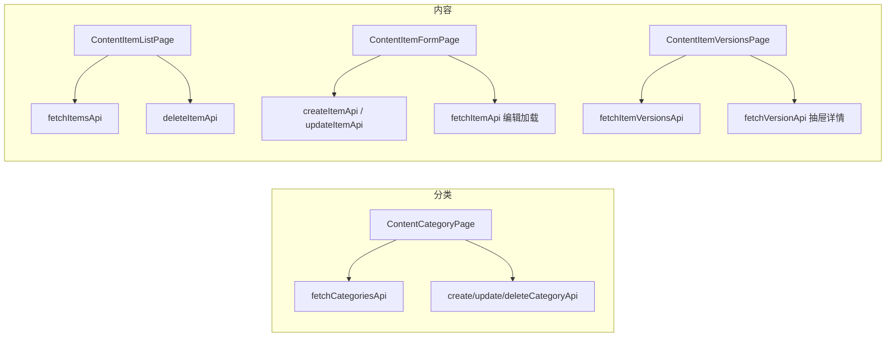

# 026 · Step 9 Phase 2 admin-web 内容管理基础页面

**交付日期**：2026-06-15  
**基于**：025-step9-admin-auth-security-closure.md、013-step5-content-module-phase1.md  
**状态**：✅ 完成

---

## 一、任务范围

在 `admin-web` 接入 ContentModule 管理端接口，实现内容分类管理、内容列表、创建/编辑、版本只读展示；路由与菜单按 RBAC 权限控制。

**本阶段未实现**：审核发布、撤回、回滚、内容关联、文件上传、首页配置、系统用户/角色管理、二期功能。

**未修改**：`backend/**`、数据库及迁移、`kiosk-app/**` 业务功能、端口配置（3100 / 5183 / 5184）。

**未访问数据库**：未连接 `oms_db`、`mydb`、`touch_kiosk_dev`、`touch_kiosk_test` 或任何其他项目数据库。

---

## 二、实际修改文件

### API 与工具

| 文件 | 说明 |
|---|---|
| `admin-web/src/api/http.ts` | 新增 `adminPut`、`adminDelete` |
| `admin-web/src/api/content/types.ts` | 分类/内容/版本类型与分页 |
| `admin-web/src/api/content/categories.ts` | 分类 CRUD API |
| `admin-web/src/api/content/items.ts` | 内容 CRUD + 版本 API |
| `admin-web/src/constants/content.ts` | 9 类 contentType 白名单、状态中文标签、禁止字段 |
| `admin-web/src/utils/contentForm.ts` | 构建 Create/Update payload，过滤禁止字段 |
| `admin-web/src/composables/usePermission.ts` | 内容权限 computed |

### 页面与路由

| 文件 | 说明 |
|---|---|
| `admin-web/src/pages/ForbiddenView.vue` | 403 无权限页 |
| `admin-web/src/pages/content/ContentCategoryPage.vue` | 分类树形列表、增删改、409 提示 |
| `admin-web/src/pages/content/ContentItemListPage.vue` | 内容分页列表、筛选、删除确认 |
| `admin-web/src/pages/content/ContentItemFormPage.vue` | 创建/编辑、防重复提交、离开未保存提示 |
| `admin-web/src/pages/content/ContentItemVersionsPage.vue` | 版本列表 + 详情抽屉（只读） |
| `admin-web/src/router/index.ts` | 内容路由 + `meta.permission` 守卫 |
| `admin-web/src/layouts/AdminLayout.vue` | 内容管理子菜单（按 read 权限显隐） |

### 测试

| 文件 | 说明 |
|---|---|
| `admin-web/tests/content.permissions.spec.ts` | 权限码、SUPER_ADMIN、`*` |
| `admin-web/tests/content.routes.spec.ts` | 403 路由、有权限放行 |
| `admin-web/tests/content.categories.spec.ts` | 分类 API、409 |
| `admin-web/tests/content.items.spec.ts` | 分页筛选、创建字段 |
| `admin-web/tests/content.versions.spec.ts` | 版本只读 |
| `admin-web/tests/content.form.spec.ts` | 禁止字段过滤 |
| `admin-web/tests/content.submit.spec.ts` | 防重复提交、删除确认逻辑 |

### 其他

| 文件 | 说明 |
|---|---|
| `CLAUDE.md` | 更新 admin-web 状态 |
| `docs/dev-logs/026-step9-admin-content-pages.md` | 本报告 |

---

## 三、使用的实际后端接口与 DTO

### 分类

| 接口 | DTO / 响应 |
|---|---|
| `GET /api/admin/content/categories` | Query: `page`, `pageSize`, `contentType`, `parentId`（`""` 查根）→ 分页 `CategoryListItem` |
| `POST /api/admin/content/categories` | `CreateCategoryDto`: `categoryName`, `contentType`, `parentId?`, `sortOrder?` |
| `PUT /api/admin/content/categories/:id` | `UpdateCategoryDto`: `categoryName?`, `sortOrder?`, `status?`（`active`/`disabled`） |
| `DELETE /api/admin/content/categories/:id` | 409：仍有子分类 / 仍有内容 |

### 内容

| 接口 | DTO / 响应 |
|---|---|
| `GET /api/admin/content/items` | Query: `page`, `pageSize`, `contentType`, `categoryId`, `status`, `title` |
| `GET /api/admin/content/items/:id` | `ItemDetail`（无 `body`，正文在版本表） |
| `POST /api/admin/content/items` | `CreateItemDto` |
| `PUT /api/admin/content/items/:id` | `UpdateItemDto` |
| `DELETE /api/admin/content/items/:id` | 软删除 |

**前端禁止提交**：`status`、`currentVersionId`、`publishAt`（`buildCreateItemPayload` / `buildUpdateItemPayload` 白名单过滤）。

### 版本（只读）

| 接口 | 响应 |
|---|---|
| `GET /api/admin/content/items/:id/versions` | `VersionListItem[]` |
| `GET /api/admin/content/versions/:versionId` | `VersionDetail`（含 `body`, `extraJson`） |

### contentType 白名单（9 类）

`policy_file`, `policy_interpretation`, `open_guide`, `open_system`, `open_catalog`, `annual_report`, `organization`, `faq`, `notice`

---

## 四、权限控制规则

| 权限码 | 用途 |
|---|---|
| `content:category:read` | 菜单「内容分类」、路由 `/content/categories` |
| `content:category:create/update/delete` | 分类新增/编辑/删除按钮 |
| `content:item:read` | 菜单「内容列表」、路由 `/content/items` |
| `content:item:create` | 新建、路由 `/content/items/create` |
| `content:item:update` | 编辑、路由 `/content/items/:id/edit` |
| `content:item:delete` | 列表删除 |
| `content:version:read` | 版本页、路由 `/content/items/:id/versions` |

- 路由 `meta.permission` 不满足 → `/forbidden`（403 页），不仅隐藏按钮。
- `SUPER_ADMIN` 或 `permissions` 含 `*` → 全部权限（沿用 auth store）。
- 菜单：`content:category:read` 或 `content:item:read` 至少一项才显示「内容管理」子菜单。

---

## 五、页面与数据流



- 列表：加载态 `v-loading`、失败 `el-alert`、空数据 `el-empty`。
- 表单：保存成功返回列表；`onBeforeRouteLeave` 未保存提示；`submitting` 防重复点击。
- 删除：`ElMessageBox.confirm` 二次确认。
- 分类删除 409：展示后端 `message`（如「该分类下仍有子分类，不允许删除」）。

---

## 六、自动化测试覆盖

| 类别 | 用例数 | 文件 |
|---|---|---|
| 权限与 403 路由 | 8 | `content.permissions.spec.ts`, `content.routes.spec.ts` |
| 分类 CRUD / 409 | 4 | `content.categories.spec.ts` |
| 内容分页 / 创建 | 4 | `content.items.spec.ts` |
| 版本只读 | 3 | `content.versions.spec.ts` |
| 禁止字段 | 3 | `content.form.spec.ts` |
| 防重复提交 / 删除确认 | 4 | `content.submit.spec.ts` |
| 认证回归 | 26 | 既有 auth/router/http 测试 |

**合计**：12 文件，**52** tests passed（全部 mock HTTP，不依赖真实 DB）。

401 会话失效：沿用 `http.unauthorized.spec.ts` 与 `auth-flow.spec.ts`。

---

## 七、验证命令及真实结果

### admin-web

```bash
cd admin-web
npm run type-check   # exit 0
npm run build        # exit 0
npm test             # 12 files, 52 tests passed
```

### backend（回归，未改代码）

```bash
cd backend
npm run type-check   # exit 0
npm test -- --runInBand   # 341 passed
```

### kiosk-app（回归，未改代码）

```bash
cd kiosk-app
npm run build                              # exit 0
npx vue-tsc --noEmit -p tsconfig.check.json   # exit 0
cd tests && npm test                       # 91 passed
```

---

## 八、远程 IP 访问结果

```bash
curl --noproxy '*' -i http://10.217.19.22:5183/                      # HTTP 200
curl --noproxy '*' -i http://10.217.19.22:5183/api/public/home/config  # HTTP 200
curl --noproxy '*' -i http://10.217.19.22:5184/login                 # HTTP 200
curl --noproxy '*' -i http://10.217.19.22:5184/api/admin/auth/profile  # HTTP 401（未登录，符合预期）
```

端口保持：`backend 3100`、`kiosk-app 5183`、`admin-web 5184`，`strictPort: true`，`/api` 代理 `localhost:3100`。未使用 5173、5174、8000。

**说明**：未使用真实管理员账号做浏览器全链路内容 CRUD；联调以 mock 测试 + 远程 HTTP 可达性为准（项目无默认种子管理员）。

---

## 九、未完成事项与风险

| 项 | 说明 |
|---|---|
| 编辑页正文回显 | `ItemDetail` 不含 `body`，编辑时正文需重新输入或查版本详情（后端设计） |
| 富文本 | 本阶段使用 textarea，后续可接编辑器 |
| 分类单条查询 | 后端无 `GET /categories/:id`，编辑用列表数据 |
| 真实账号 E2E | 需开发库管理员账号 |
| 审核发布 | Step 10+ 接入 PublishModule |

---

## 十、跨工程变更声明

| 工程 | 本阶段是否修改 |
|---|---|
| `backend/` | **否** |
| `kiosk-app/` | **否** |
| 数据库 / 迁移 | **否** |
| `admin-web/` | **是**（本阶段主体） |

**数据库访问**：本阶段未执行任何 SQL，未访问任何项目数据库。
