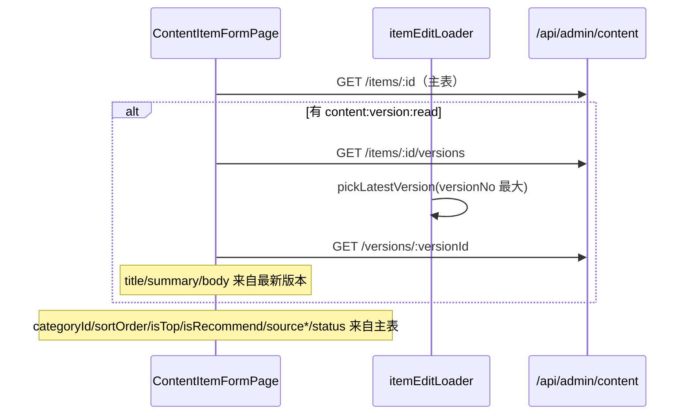

# 027 · Step 9 Phase 2 内容管理验收修复

**交付日期**：2026-06-15  
**基于**：026-step9-admin-content-pages.md  
**状态**：✅ 完成

---

## 一、026 复验问题说明

026 报告记载 **52 tests passed**，但 Codex 复验时 `content.routes.spec.ts` 中 **「有 content:category:read 可进入分类页」** 出现 **超时失败**。

| 项 | 说明 |
|---|---|
| 根因 | 测试直接 `import { routes } from '@/router/index'`，触发 **懒加载** `ContentCategoryPage` 等大型页面 + Element Plus 初始化，在 Vitest 中挂起 |
| 非根因 | 非业务逻辑缺陷；非单纯需要更长 timeout |
| 修复 | 路由权限测试改用 **轻量 Stub 路由** + 仅 `registerAuthGuard`，不加载真实页面组件 |

---

## 二、实际修改文件

| 文件 | 说明 |
|---|---|
| `admin-web/tests/content.routes.spec.ts` | 轻量测试路由，移除对完整 `routes` 懒加载依赖 |
| `admin-web/src/utils/itemEditLoader.ts` | **新增** 编辑数据加载：主表 + 最新版本 |
| `admin-web/src/utils/contentForm.ts` | `buildUpdateItemPayload` 支持显式清空（`key in form` + 空字符串） |
| `admin-web/src/api/content/categories.ts` | **新增** `fetchAllCategoriesApi` 分页拉取全量 |
| `admin-web/src/pages/content/ContentItemFormPage.vue` | 版本回显、无 version:read 禁用、防重复提交、未保存守卫 |
| `admin-web/src/pages/content/ContentCategoryPage.vue` | 编辑父分类只读、分页分类、`defineExpose`、防重复提交 |
| `admin-web/src/pages/content/ContentItemListPage.vue` | 使用 `fetchAllCategoriesApi` |
| `admin-web/src/composables/useUnsavedGuard.ts` | **新增** 未保存离开确认 |
| `admin-web/tests/content.form.spec.ts` | 清空字段语义测试 |
| `admin-web/tests/content.categories.spec.ts` | axios-mock-adapter 真实 HTTP 验证 |
| `admin-web/tests/content.items.spec.ts` | axios-mock-adapter |
| `admin-web/tests/content.versions.spec.ts` | axios-mock-adapter |
| `admin-web/tests/content.itemEditLoader.spec.ts` | **新增** 版本加载逻辑 |
| `admin-web/tests/content.components.spec.ts` | **新增** mount 组件测试 |
| `admin-web/tests/content.submitGuard.spec.ts` | **新增** 防重复提交守卫 |
| `admin-web/tests/useUnsavedGuard.spec.ts` | **新增** 未保存离开 composable |
| `admin-web/tests/setup.ts` | 注册 Element Plus 插件 |
| `CLAUDE.md` | 更新状态 |
| `docs/dev-logs/027-step9-admin-content-acceptance-fix.md` | 本报告 |

**删除**：`admin-web/tests/content.submit.spec.ts`（由真实组件/guard 测试替代）

**未修改**：`backend/**`、数据库、kiosk-app 业务、端口配置。

**未访问数据库**。

---

## 三、最新版本回显流程



---

## 四、无 `content:version:read` 时行为

- 不请求 versions / version 详情接口
- 显示警告：**「无版本查看权限，版本内容保持不变」**
- **禁用** title、summary、body、变更说明输入
- 正文框 **为空且 disabled**，不出现可编辑空白正文
- 仍可编辑 subtitle、categoryId、sortOrder、isTop、isRecommend、sourceType、sourceUrl
- 保存时 **不提交** 版本相关字段（title/summary/body/changeRemark）

---

## 五、字段清空语义

`buildUpdateItemPayload` 规则：

| 调用方式 | 行为 |
|---|---|
| 字段 **未出现在** 入参对象 | 不进入 payload（保持原值） |
| 字段值为 `''` | 进入 payload，提交空字符串（后端置 null） |
| `status` / `currentVersionId` / `publishAt` | 始终过滤 |

编辑保存时显式传入可编辑字段当前值；清空即传 `''`。

---

## 六、分类父级与分页

### 父分类

- 编辑模式：父分类 **只读** `el-input disabled`，文案「父分类在创建后暂不支持调整」
- `UpdateCategoryDto` **不提交** `parentId`

### 分页策略（`fetchAllCategoriesApi`）

- 每页 `pageSize=100`（后端上限）
- 循环拉取直至 `list.length >= total` 或空页
- **最多 20 页**（2000 条上限），超出抛 `ApiError` 明确提示
- 用于分类树、内容列表/表单下拉

---

## 七、测试失败修复与覆盖

### 路由超时修复

- 使用 Stub 组件 + `meta.permission` 轻量路由表
- 不再 import 完整 `routes` 懒加载链

### 测试体系（不再 mock 整个 API 模块后自调用）

| 类型 | 文件 | 说明 |
|---|---|---|
| HTTP 契约 | `content.categories/items/versions.spec.ts` | **axios-mock-adapter** 验证 method/URL/query/body |
| 加载逻辑 | `content.itemEditLoader.spec.ts` | 最新版本选择、无权限分支 |
| 表单语义 | `content.form.spec.ts` | 清空 vs undefined |
| 组件 mount | `content.components.spec.ts` | 版本正文回显、409 文案、PUT body |
| 守卫 | `content.submitGuard.spec.ts`、`useUnsavedGuard.spec.ts` | 防重复、未保存离开 |
| 路由 | `content.routes.spec.ts` | 403 / 放行 |

### 两次管理端测试结果（连续运行）

```bash
cd admin-web
npm run type-check   # exit 0
npm run build        # exit 0
npm test             # 15 files, 64 tests passed, exit 0
npm test             # 15 files, 64 tests passed, exit 0（第二次）
```

---

## 八、三工程回归

```bash
cd backend && npm run type-check && npm test -- --runInBand
# 14 suites, 341 passed

cd kiosk-app && npm run build && npx vue-tsc --noEmit -p tsconfig.check.json
cd tests && npm test
# 17 files, 91 passed
```

---

## 九、远程 IP 验证

```bash
curl --noproxy '*' http://10.217.19.22:5183/                        # 200
curl --noproxy '*' http://10.217.19.22:5183/api/public/home/config  # 200
curl --noproxy '*' http://10.217.19.22:5184/login                    # 200
curl --noproxy '*' http://10.217.19.22:5184/api/admin/auth/profile  # 401
```

---

## 十、未完成风险

| 项 | 说明 |
|---|---|
| 分类超 2000 条 | 需运营侧控制或后续后端全量接口 |
| `extraJson` | 编辑表单未展示 UI 字段，回显但不主动提交 |
| 真实账号 E2E | 仍依赖开发库管理员账号 |
| 审核发布 | 本阶段未实现 |

---

## 十一、跨工程变更声明

| 工程 | 是否修改 |
|---|---|
| `backend/` | **否** |
| `kiosk-app/` | **否** |
| 数据库 | **否** |
| `admin-web/` | **是** |

**数据库访问**：未执行任何 SQL，未连接任何项目数据库。
