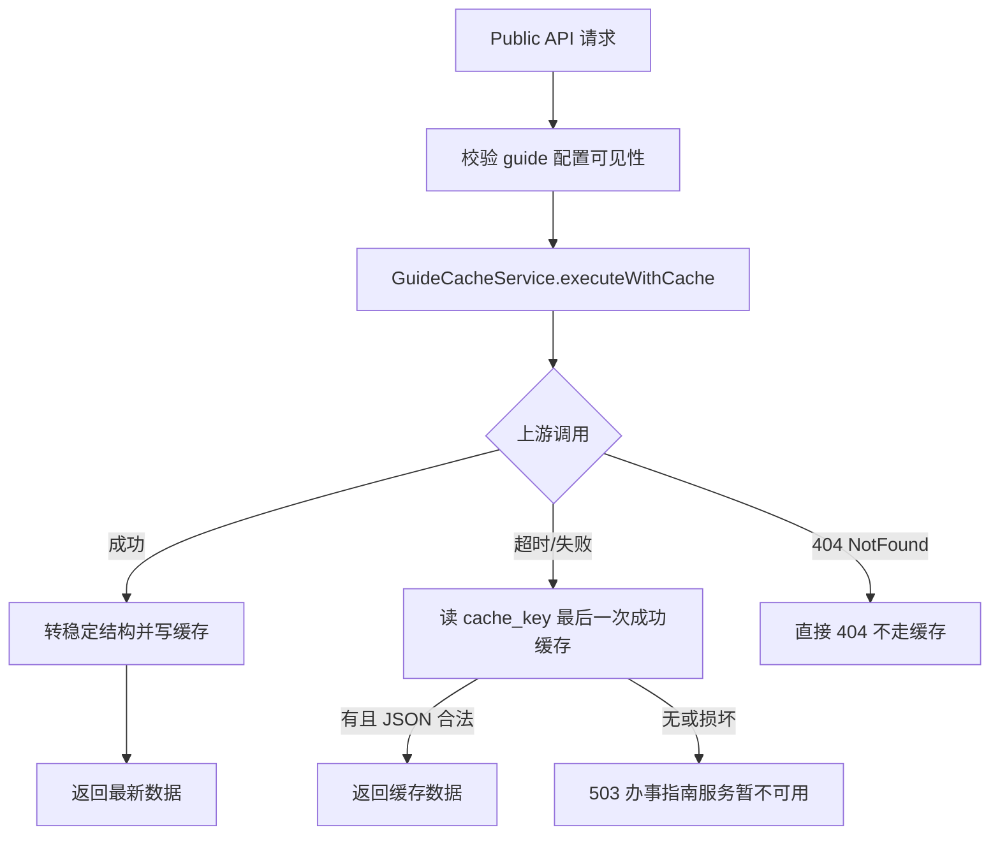

# 038 · Step 12：ServiceGuideModule 公共查询接口与缓存基础

**交付日期**：2026-06-15  
**基于**：037-step11-admin-guide-config-pages.md  
**状态**：✅ 完成（未对接真实大数据共享平台）

---

## 一、旧 mock 实现审查结论

| 项目 | 结论 |
|---|---|
| `ServiceGuideService` 原实现 | 纯内存原型 mock，硬编码 `d-001`/`t-001`/`i-001` 等，**未**读取 `guide_dept_mapping` / `guide_item_config` |
| Public API 路由 | 与 `api-spec.md` §十五一致，**保留路径** |
| `PublicItemDetailDto` 字段形状 | 与 kiosk-app `ItemDetail` 一致，**必须保留** |
| 部门/主题列表来源 | 旧实现来自内存数组，与规范不符；本步改为 **guide 配置表** |
| 上游事项数据 | 旧实现与配置混在同一 Service；本步拆为 **Provider + 缓存 + 配置** 三层 |
| `stats.spec.ts` 依赖 | 依赖 mock 事项 ID（`i-001` 等）；通过 **DevelopmentMock catalog + exists* mock fallback** 保持语义校验可用 |

**保留策略**：上游示例数据迁入 `DevelopmentMockServiceGuideProvider` + `development-mock.catalog.ts`（标记 `__DEVELOPMENT_MOCK_EXAMPLE_DATA__`）；公开 DTO 形状不变；路由不变。

---

## 二、新增与修改文件

### 新增

| 路径 | 说明 |
|---|---|
| `backend/src/database/entities/guide-api-cache.entity.ts` | 缓存实体 |
| `backend/src/database/migrations/1749921600000-CreateGuideApiCacheTable.ts` | 建表迁移（未执行） |
| `backend/src/service-guide/types/public-service-guide.types.ts` | 公开 DTO 类型 |
| `backend/src/service-guide/types/upstream.types.ts` | 内部上游类型 |
| `backend/src/service-guide/constants/service-guide.constants.ts` | API 名、Provider 类型、超时/TTL |
| `backend/src/service-guide/providers/*` | Provider 接口、Mock、Real、Factory、错误类、catalog |
| `backend/src/service-guide/cache/guide-cache-key.util.ts` | 稳定 cache_key |
| `backend/src/service-guide/cache/guide-cache.service.ts` | 最后一次有效数据缓存 |
| `backend/src/service-guide/public-guide-config.service.ts` | 读取 guide 三张配置表 |
| `backend/src/service-guide/guide-related-content.service.ts` | 关联已发布政策/FAQ |
| `backend/src/service-guide/service-guide-detail.mapper.ts` | 上游详情 → 公开 DTO |
| `backend/test/service-guide-public.spec.ts` | 公共 API、缓存、DTO、关联内容测试 |
| `backend/test/guide-cache-key.util.spec.ts` | cache_key 稳定性 |
| `backend/test/guide-api-cache-migration.spec.ts` | 迁移 DDL 审查 |
| `backend/test/service-guide-provider.factory.spec.ts` | Provider 配置边界 |

### 修改

| 路径 | 说明 |
|---|---|
| `backend/src/service-guide/service-guide.service.ts` | 编排 config + cache + provider |
| `backend/src/service-guide/service-guide.module.ts` | 注册 TypeORM 实体与依赖 |
| `backend/src/service-guide/dto/items-query.dto.ts` | deptCode/themeCode trim+uppercase |
| `backend/src/public-api/controllers/service-guide.controller.ts` | async + requestId |
| `backend/src/public-api/controllers/stats.controller.ts` | exists* 改为 async |
| `backend/src/database/database-config.factory.ts` | 14 实体 / 14 迁移 |
| `backend/test/helpers/project-schema-reset.ts` | drop 顺序加入 `guide_api_cache` |
| `backend/test/database-config.spec.ts` | 13→14 |
| `backend/test/highgo-metadata.spec.ts` | 13→14 + guide_api_cache 元数据 |
| `backend/test/content-migration-fresh-install.spec.ts` | 13→14 |
| `backend/test/stats.spec.ts` | mock ServiceGuideService exists* |
| `CLAUDE.md` | 开发状态 |

### 未修改

- `admin-web/**`、`kiosk-app/**`
- 实际数据库（未连接、未执行迁移）
- 端口 5183、5184、3100

---

## 三、Provider 抽象及选择方式

```
ServiceGuideProvider (interface)
├── DevelopmentMockServiceGuideProvider  ← SERVICE_GUIDE_PROVIDER=development（默认）
└── RealServiceGuideProvider             ← SERVICE_GUIDE_PROVIDER=real + SERVICE_GUIDE_UPSTREAM_BASE_URL
```

| 环境变量 | 说明 |
|---|---|
| `SERVICE_GUIDE_PROVIDER` | `development`（默认）或 `real` |
| `SERVICE_GUIDE_UPSTREAM_BASE_URL` | real 模式必填；缺省时启动失败 |
| `SERVICE_GUIDE_UPSTREAM_TIMEOUT_MS` | 上游超时，默认 5000ms |

- 群众端**不得**传入上游地址或平台参数。
- `RealServiceGuideProvider`：无正式接口文档，构造缺 URL 或任意方法调用均抛 `ServiceGuideProviderNotConfiguredError`，**不猜测协议**。
- `ServiceGuideProviderFactory` 在 `onModuleInit` 完成选择与初始化。

---

## 四、公开 DTO

事项列表/详情**不透传**上游内部字段。事项详情统一为 api-spec 规定的 13 个顶层字段：

`basicInfo`、`acceptConditions`、`materials`、`processSteps`、`locations`、`workTime`、`timeLimit`、`fee`、`legalBasis`、`consultationPhone`、`complaintPhone`、`relatedPolicies`、`relatedFaqs`

- 缺失字段使用 `null`、空字符串或空数组等稳定类型。
- `relatedPolicies` / `relatedFaqs`：根据 `guide_item_config` 关联 ID 查询 **已发布** `policy_file` / `faq` 内容，仅返回 `{ id, title }`。
- **不返回**：`platformParamJson`、`requestParam`、`responseBody`、上游 URL、凭据等。

部门/主题列表来自配置表；`isHot` 由 `guide_item_config.is_hot` 合并到列表项。

---

## 五、guide_api_cache 表设计

| 字段 | 类型 | 说明 |
|---|---|---|
| id | varchar(36) | 后端 UUID |
| cache_key | varchar(255) | **唯一索引** `uk_guide_api_cache_cache_key` |
| api_name | varchar(50) | 接口名 |
| request_param | text | 序列化请求参数 |
| response_body | text | 序列化成功响应 |
| success_at | timestamp | 最近成功时间 |
| expire_at | timestamp nullable | TTL 记录（兜底读缓存时忽略过期） |
| created_at / updated_at | timestamp | 审计字段 |

**逻辑删除**：本表为基础设施缓存表，**不采用** `deleted_at`。理由（见 `database.md` 基础设施表约定）：缓存行可被覆盖或自然淘汰，无需业务软删除语义；失败响应**不写入**缓存。

**兼容性**：`request_param`/`response_body` 为 text；无 enum/JSON/自增/触发器；TypeORM 标准迁移；MySQL 8 与 HighGo 元数据测试已覆盖。

**迁移**：`1749921600000-CreateGuideApiCacheTable.ts` 已编写，**未在本环境执行**。

---

## 六、缓存键规则

```
cache_key = `${apiName}|${JSON.stringify(sortedParams)}`
```

- `sortParamKeys` 对参数键名字母排序，忽略 `undefined`。
- 参数顺序不同产生相同 key（已测试）。

API 名：`dept_item_types`、`theme_item_types`、`item_list`、`item_detail`。

---

## 七、成功 / 失败 / 超时 / 无缓存流程



- 成功：写/更新 `guide_api_cache`，设置 `expire_at`（默认 TTL 1h）。
- 失败/超时：读同 key 最近成功记录（**忽略 expire_at**）。
- 损坏 JSON：视为无缓存。
- 无缓存：`ServiceUnavailableException` → code 503。

---

## 八、安全与日志

- 上游超时：`SERVICE_GUIDE_UPSTREAM_TIMEOUT_MS`（默认 5s）。
- 日志仅记录：`apiName`、结果（success/timeout/upstream_error/fallback）、耗时、`requestId`。
- **不记录**：凭据、完整请求参数、完整响应正文。
- Public API 保持匿名只读，无新增写接口。
- `platformParamJson` 仅内部传给 Provider，不出现在 Public 响应。

---

## 九、测试与验证结果

### 新增测试（31 个）

| 文件 | 数量 |
|---|---|
| `service-guide-public.spec.ts` | 17 |
| `guide-cache-key.util.spec.ts` | 3 |
| `guide-api-cache-migration.spec.ts` | 7 |
| `service-guide-provider.factory.spec.ts` | 4 |

覆盖：Public 匿名访问、admin/public 隔离、可见配置、编码规范化、成功写缓存、失败读缓存、无缓存 503、超时、cache_key 稳定、损坏缓存、DTO 不泄露、关联内容仅已发布、Mock/Real Provider 边界。

### 命令结果

| 命令 | 结果 |
|---|---|
| `cd backend && npm run type-check` | ✅ 通过 |
| `cd backend && npm run build` | ✅ 通过 |
| `cd backend && npm test -- --runInBand` | ✅ 529 passed，35 skipped |
| `cd admin-web && npm run type-check && npm run build && npm test -- --run` | ✅ 160 passed |
| `cd kiosk-app && npm run build && npx vue-tsc --noEmit -p tsconfig.check.json` | ✅ 通过 |
| `cd kiosk-app/tests && npm test -- --run` | ✅ 91 passed |

### 远程探测（2026-06-15）

| URL | HTTP |
|---|---|
| `http://10.217.19.22:3100/api/public/service-guide/depts` | **502**（后端未部署本步构建或服务未就绪） |
| `http://10.217.19.22:3100/api/public/service-guide/themes` | **502** |
| `http://10.217.19.22:5183` | 200 |
| `http://10.217.19.22:5184` | 200 |

> 502 表示远程 3100 网关/进程未承载新代码；本地测试已覆盖上游成功/失败/超时/缓存逻辑，不以构建通过代替运行时验证。

---

## 十、数据库

- **未连接**生产或 `oms_db` 等外部库。
- **未执行**任何迁移。
- MySQL 集成类测试仍为 skipped（需 `RUN_MYSQL_*` 环境变量）。

---

## 十一、尚缺的真实共享平台资料

- 接口基址、路径、鉴权方式（签名/Token）
- 请求/响应字段说明与错误码
- 部门/主题/事项/详情各接口契约
- 测试环境与凭据

**在获得正式文档前，不得实现或声称完成真实平台对接。**

---

## 十二、未完成事项与风险

| 项 | 说明 |
|---|---|
| 真实 Provider 实现 | 故意未实现，等待正式接口文档 |
| 远程 3100 部署 | 需运维重启/发布 backend 后公共接口方可在线验证 |
| 部门/主题空列表 | 若 guide 配置表无数据，depts/themes 返回 `[]`（符合规范）；需管理端配置后群众端才有导航数据 |
| `firstLetter` | 现取 `displayName` 首字符；旧 mock 使用拼音首字母，行为略有差异 |
| 全量/定时同步 | 本步明确不做（二期前不做） |

---

**Step 12 停止于此。无正式共享平台接口文档时，不自行实现真实对接。**
